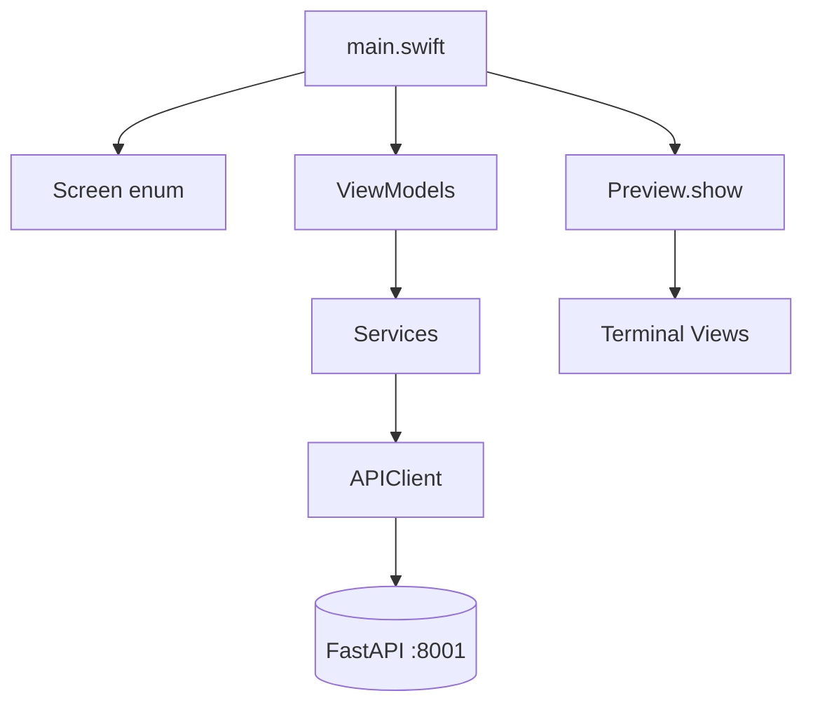

# SophiaMobileCLI

Cliente de linha de comando assíncrono em **Swift 6.2**, rodando nativamente no **Linux**. Consome a API de telemetria do ecossistema **Sophia** (backend Python/FastAPI) e exibe dados de cognição, energia, domínios e insights diretamente no terminal.

**Versão:** v0.1.0

---

## Como Executar

### 1. Subir o backend (Python)

Certifique-se de que o servidor FastAPI está ativo na porta **8001**:

```bash
cd ~/sophia-backend
# Ativa o ambiente virtual se necessário (source .venv/bin/activate)
uvicorn app.main:app --reload --port 8001
```

### 2. Executar o client (Swift)

Em outro terminal, compile e inicie a aplicação:

```bash
cd ~/swift-lab
swift run
```

### 3. Rodar testes

```bash
swift test
```

---

## Navegação

A troca de telas é imediata — **não é necessário pressionar Enter**. O loop principal re-renderiza a tela ativa a cada **3 segundos**.

| Tecla | Tela | Endpoint |
|-------|------|----------|
| `1` | Monitor de áudio ao vivo | `GET /cognition/audio` |
| `2` | Histórico (últimas 10 leituras) | memória local |
| `3` | Domínio de energia | `GET /cognition/power` |
| `4` | Lista de domínios | `GET /domains` |
| `q` | Insight mais recente | `GET /insights/latest` |
| Ctrl+C | Encerrar | — |

---

## Exemplo de Saída no Terminal

Ao iniciar com `swift run`, o banner de boot aparece antes do loop de telemetria:

```
╔══════════════════════════════╗
║      SOPHIA MOBILE CLI       ║
║          v0.1.0              ║
╚══════════════════════════════╝
Iniciando conexão com a API de telemetria...
```

### Monitor de áudio (`1`)

```
🎙️ MONITOR DE SINAL DE ÁUDIO (LIVE)
────────────────────────────────────
Status do Sistema: ATIVO
Domínio de Captura: AUDIO
────────────────────────────────────
Nível de Entrada:  -28 dB [◼◼◼◼◼◼◻◻◻◻◻◻]
Ruído de Fundo:    -52 dB
────────────────────────────────────
Classificação:    SPEECH
Confiança do IA:  87%
────────────────────────────────────
Horário do Evento: 2026-06-14T10:32:01Z

[Pressione Ctrl+C para encerrar o monitoramento]

[Pressione '2' (sem ENTER) para ir para o Histórico]
```

### Histórico (`2`)

```
=== Lista de Telemetrias Capturadas ===
---------------------------------------
Evento às 2026-06-14T10:31:58Z: SPEECH com confiança de 85%
---------------------------------------
Evento às 2026-06-14T10:32:01Z: SPEECH com confiança de 87%
---------------------------------------

[Pressione Ctrl+C para encerrar o monitoramento]

[Pressione '1' (sem ENTER) para voltar ao Monitoramento]
```

### Energia (`3`)

```
Power
────────────────────────────────────
Status: active
────────────────────────────────────
Domain: power
────────────────────────────────────
PC Online: Sim
Power State: on
Smart Plug Connected: Sim
Automation Enabled: Sim
Confidence: 0.95

[Pressione Ctrl+C para encerrar o monitoramento]

[Pressione '3' (sem ENTER) para ir ao POWER]
```

### Domínios (`4`)

```
=== Domínios ===
ID: audio
Nome: Audio Cognition
Status: active
Versão: 1.0.0
-------------------
ID: power
Nome: Power Management
Status: active
Versão: 1.0.0
-------------------

[Pressione Ctrl+C para encerrar o monitoramento]

[Pressione '4' (sem ENTER) para ir ao Domains]
```

### Insights (`q`)

```
INSIGHT: Usuário em período de foco prolongado
PATTERN: deep_work_session
LEVEL: info
SUGGESTION: Considerar pausa em 15 minutos
OBSERVATION: 0.82

[Pressione Ctrl+C para encerrar o monitoramento]

[Pressione 'q' (sem ENTER) para ir ao Insights]
```

> Os valores acima são ilustrativos. A saída real depende dos dados retornados pela API Sophia em execução.

---

## Arquitetura

O projeto segue **MVVM** com injeção de dependências por protocolo. Cada feature implementa o fluxo:

**Model → Protocolo (`*Servicing`) → Service → ViewModel (`@MainActor`) → View**



### Navegação

O enum `Screen` centraliza o estado de navegação com cinco telas: `liveMonitor`, `history`, `power`, `domains` e `insights`. Definido em `Sources/SophiaMobileCLI/Core/ScreenEnum.swift`.

### Rede

O `APIClient` genérico usa `URLSession` para requisições HTTP tipadas. Erros do FastAPI são decodificados via `FastApiError` e propagados como `APIError` para as views de erro.

### Entrada de teclado não-bloqueante

Loops baseados em `readLine()` bloqueiam a thread principal até capturar Enter. A solução usa POSIX (`termios` + `poll`) para colocar o terminal em modo *raw* e ler teclas instantaneamente a cada ciclo do loop de renderização.

### UI no terminal

Como SwiftUI não está disponível no Linux CLI, o projeto implementa um mini-framework de UI inspirado nele: protocolo `View` com `render() -> String`, componentes `VStack`/`HStack`/`Text` e cores ANSI. A função `Preview.show()` limpa a tela e imprime o resultado.

---

## Estrutura do Projeto

```
Sources/SophiaMobileCLI/
├── App/main.swift              # Loop assíncrono + teclado POSIX
├── Core/
│   ├── ScreenEnum.swift        # Navegação
│   ├── Configuration/          # Environment (base URL)
│   ├── Networking/             # APIClient + protocolo
│   └── Errors/                 # APIError, FastApiError
├── Features/
│   ├── Audio/                  # Model → UseCase → Service → ViewModel
│   ├── Power/
│   ├── Domains/
│   └── Insight/
└── UI/
    ├── Core/View.swift         # Protocol View + Preview
    ├── Components/             # Text, VStack, HStack, Divider
    └── Screens/                # 6 views de terminal
Tests/
└── SophiaMobileCLITests/       # Testes do app (Swift Testing)
```

---

## Configuração de Rede no Linux

A URL base da API é centralizada em `Sources/SophiaMobileCLI/Core/Configuration/Environment.swift`:

```swift
static let current = Environment(baseUrl: URL(string: "http://127.0.0.1:8001")!)
```

Se a porta do Uvicorn mudar, altere `baseUrl` nesse arquivo antes de compilar.

No Linux, `URLSession` exige `import FoundationNetworking` (já presente em `main.swift` e `APIClient.swift`).

---

## Stack Técnica

- **Swift Package Manager 6.2** — zero dependências externas
- **Projeto Linux-first** via SPM (sem `.xcodeproj`)
- **Swift 6:** `async/await`, `@MainActor`, `Sendable`, typed throws
- Debug opcional via `.vscode/launch.json`
